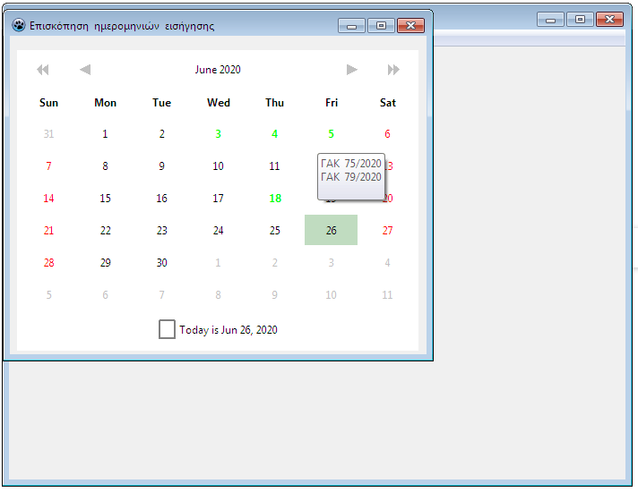

						        Schedule of prejudicial appeals
										
A CRUD app where the user is able to schedule chronologically prejudicial appeals from initial to final stage. More specifically, a user can enter a prejudicial appeal and afterwards assign a specific lecturer and lecture date. Before lecture date, he has got also the ability to alter again lecturer and lecture date of specific prejudicial appeal. Dates of suspended judgement and judgement are automatically assigned in both of these processes. Furthermore he has got also the ability to find particular prejudicial appeals via specific date intervals, delete or edit them according to his own needs.

A calendar view of all lecture dates is provided for his own convenience, as well as a list of all deadline prejudicial appeals that should be completed at a period of four days as *a reminder*.  Several reports chronologically via month, year and all years of counting prejudicial appeals via specific lecturer are provided for statistical purposes.

This app has been made via [Lazarus 2.x](https://www.lazarus-ide.org/), [Firebird 3.x](https://firebirdsql.org/) as DBMS, [FlameRobin](http://www.flamerobin.org/) as DB admin tool and several other specific [lazarus  packages](https://packages.lazarus-ide.org/). 

**Insert view**

**Edit view**

**Reminder view**

**Modify view**

**Calendar view**

**Report view**

